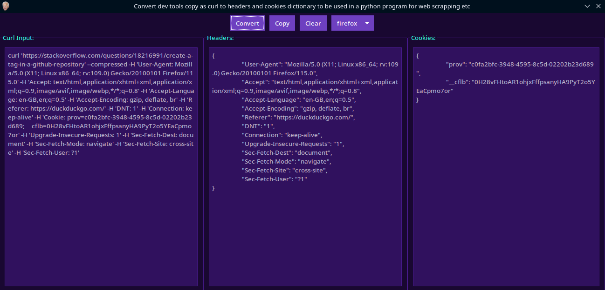

# DevToolsConvert-
Simple functional script to convert copy as curl in dev tools > network page. useful for web scraping and other stuff in python which requires cookies and headers.

Requires [ttkbootstrap](https://pypi.org/project/ttkbootstrap/)
```
pip3 install ttkbootstrap
```



